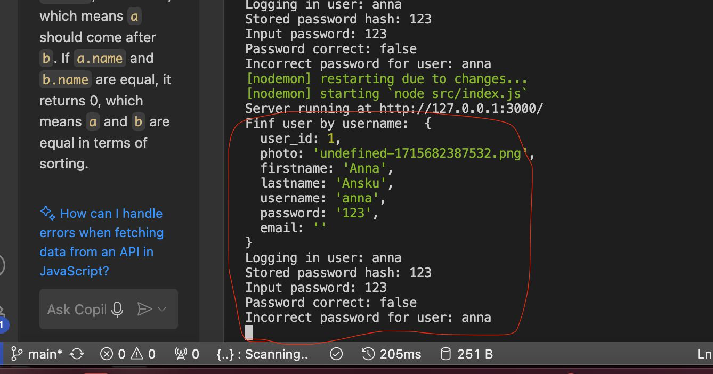

# Yksilötehtävä,

Tehtävät tallennettu myös omaan public_html kansioon:

[Yksilötehtävä eClound](https://users.metropolia.fi/~annagao/wsk_tehtavat/yksilotehtava/html/index.html)

[Public kansio](https://users.metropolia.fi/~annagao/wsk_tehtavat/yksilotehtava/html/)
Tässä on korjattu versio tekstistä:

---

Tehdy:

- Ravintolat listattu, joten kaupungin ja firman nimen mukaan.

- Ravintolat ravintolat kartalla. Lähin ravintola on merkitty oranssilla, oletuspaikka vihreällä ja muut sinisellä. Kun painat kuplaa, avautuu ikkuna, jossa on ravintolan tiedot ja menupainike. Menupainikkeen kautta pääset tarkistamaan päivän tai viikon menun.

- Myös ravintolalistan rivin kautta ravintolaa näet ravintolan tiedot ja menupainikkeen.

- Rekisteröintilomakkeen kautta voi luoda uuden käyttäjän. Voit myös lisätä kuvan nimitietokantaan. Kuva tallennetaan uploads-kansioon.

- Lähdekoodit ovat GitHubissa, myös public-kansiossa.

- Kirjautuminen jää jumiin: vaikka käyttäjätunnus ja salasana ovat oikein ja tulostuvat konsoliin, seuraava rivi näyttää "false", salasana on väärä.

